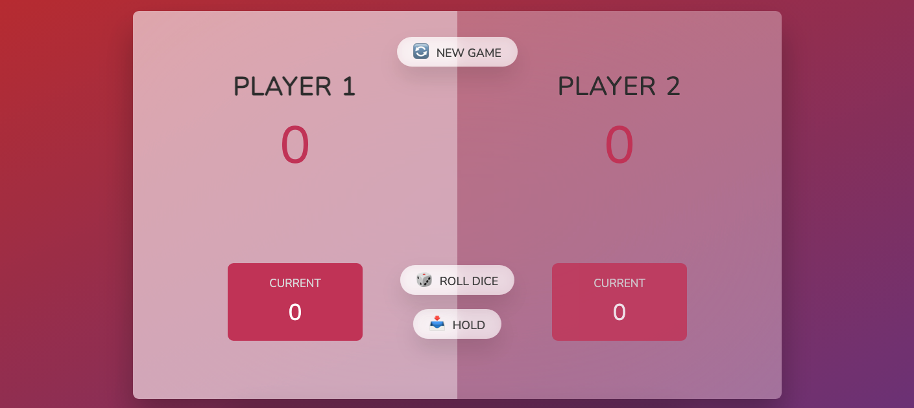

# 🎲 Pig Game

A fun and interactive dice game built using **HTML, CSS, and JavaScript**! Test your luck and strategy against a friend in this two-player turn-based game.

## 🚀 Features

- 🎮 **Two-player mode**: Compete against a friend.
- 🎲 **Dice rolling mechanic**: Random dice rolls determine the game.
- 🏆 **Winning condition**: First player to reach **100 points** wins!
- 🔄 **Reset game**: Start fresh anytime.
- 🕹️ **Simple and interactive UI**: Easy to understand and play.

## 📜 Game Rules

1. Each turn, a player rolls a dice:
   - If the roll **is not 1**, the number is **added to their current score**.
   - If the roll **is 1**, the player's turn **ends** and they **lose their current score**.
2. The player can choose to **Hold**, adding their current score to their total score and **passing the turn** to the other player.
3. The first player to reach **100 points wins the game**.

## 📂 Project Structure

```
📁 Pig Game
├── 🎲 dice-1.png to dice-6.png (Dice images)
├── 📄 index.html (Game layout)
├── 🎨 style.css (Styling & UI design)
├── 🛠️ script.js (Game logic)
└── 📜 README.md (This file)
```

## 🛠️ Technologies Used

- **HTML** → Structuring the game layout.
- **CSS** → Styling the game with a cute UI.
- **JavaScript** → Implementing game logic and interactivity.

## 🎮 How to Play

1. Open **index.html** in a browser:
   - Double-click `index.html` to launch the game.
   - Or, right-click `index.html`, select **"Open With"**, and choose a web browser (Chrome, Firefox, Edge, etc.).
2. Click **"Roll Dice"** to roll.
3. Click **"Hold"** to save your score and pass the turn.
4. First player to **100 points wins**!
5. Click **"New Game"** to start over.

## 📸 Screenshots

### 🎲 Game Flowchart


### 🎮 Game UI


